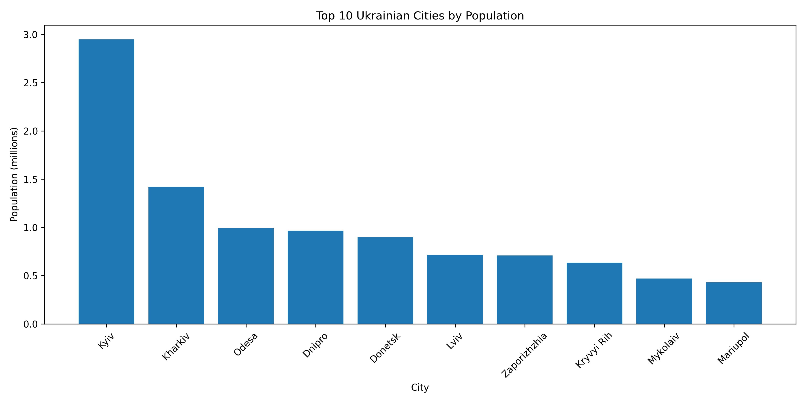
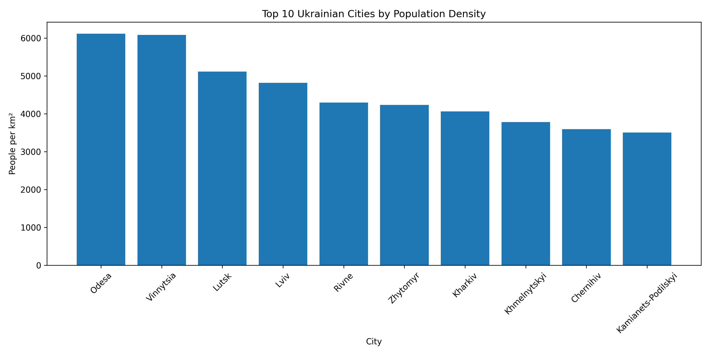
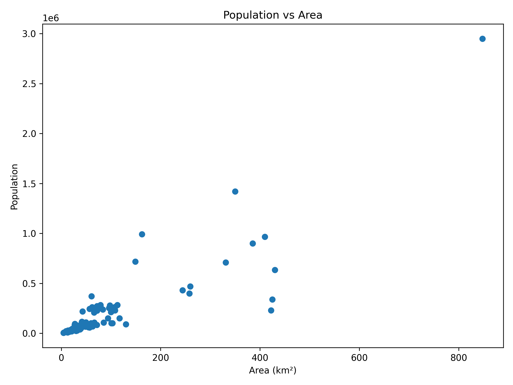

## Ukrainian Cities: Population, Area and Density
## Project Overview
This is a pet project based on my personal interests. I am curious about Ukrainian geography and demographics. My dad and my brother would always test my knowledge on this matter. I love facts as well. 

## Questions

- Where does my hometown, Kamianets-Podilskyi, rank among Ukrainian cities in terms of population, area, and population density?
- What are the largest cities in Ukraine by population?
- What are the largest cities in Ukraine by area?
- Which Ukrainian cities have the highest population density?
- Is there a relationship between a city's area and its population?
- Are the most populous cities also the most densely populated?
- Which cities stand out as outliers in terms of population, area, or density?
- How does Kyiv compare to other Ukrainian cities?
- Which oblasts contain the largest cities?
- What interesting facts can be discovered about Ukrainian cities through data analysis?

## Dataset 
Unfortunately I couldn't find a proper dataset with relevant information. Most of data is of 2022 latest. I realise that current cituations differs a lot and I wish there was new data.
The dataset contains 100 Ukrainian cities, including:
All oblast capitals (25 cities)
Most cities with population over ~50,000
A few smaller cities for regional coverage
Cities in temporarily occupied territories (Donetsk, Luhansk, Mariupol) are included 
The dataset was made by claude ai using Wikipedia and State Statistics Service of Ukraine data. I randomly checked the information. I also have a good knowledge so I cuold spot if somwthing was odd.

## EDA 
The data was mostly clean and required minimal preprocessing.
The analysis included:
- Checking data types
- Checking for missing values
- Identifying and removing duplicate records
- Calculating population density
- Exploring relationships between population, area, and density

## Visualizations

### Top 10 Ukrainian Cities by Population

Kyiv is the largest city in Ukraine with a population of almost 3 million residents. It is followed by Kharkiv, while Odesa and Dnipro form the next tier of major Ukrainian cities.

### Top 10 Ukrainian Cities by Population Density

Population density varies significantly across Ukrainian cities. Several medium-sized cities rank among the most densely populated, showing that population size and density are not the same measure.

### Population vs Area

There is a strong positive relationship between city area and population (correlation coefficient: 0.87). Kyiv stands out as a clear outlier.

## Key Insights
- Kyiv is a clear outlier, having both the largest population and the largest area among the cities in the dataset.
- Population and area show a strong positive correlation (r = 0.87).
- Larger cities generally tend to have larger populations.
- Population size and population density are not the same.
- Odesa has a higher population density than Kyiv despite having a much smaller population.

## My Hometown: Kamianets-Podilskyi

One of the motivations behind this project was to understand where my hometown, Kamianets-Podilskyi, ranks among Ukrainian cities.

Key findings:

- Population: 95,607 residents
- Population rank: 41st out of 100 cities analyzed
- Population density: 3,506 people per km²
- Density rank: 10th out of 100 cities analyzed

Although Kamianets-Podilskyi is not among the largest Ukrainian cities by population, it is one of the most densely populated cities in the dataset.

## Technologies Used

- Python
- Pandas
- Matplotlib
- Jupyter Notebook
- GitHub